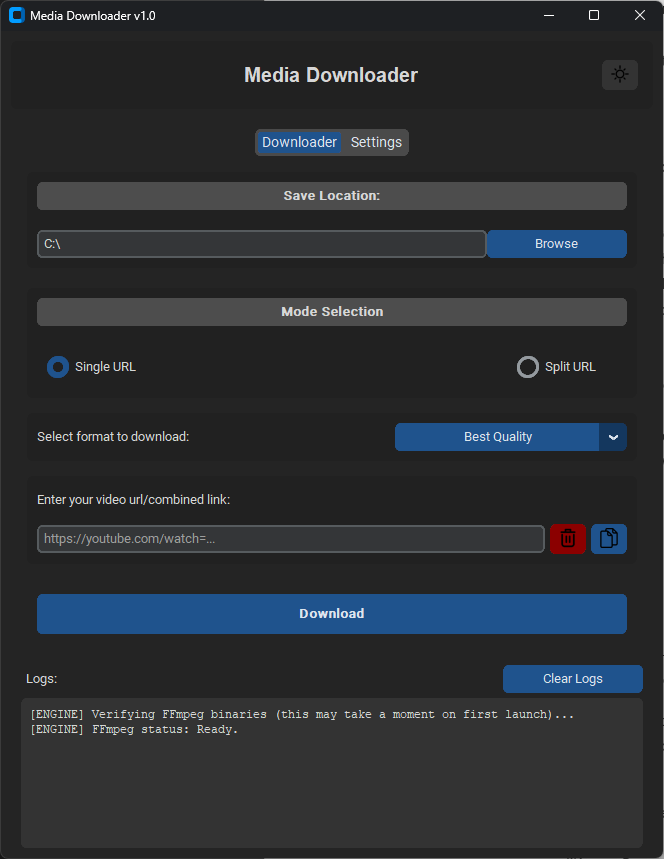
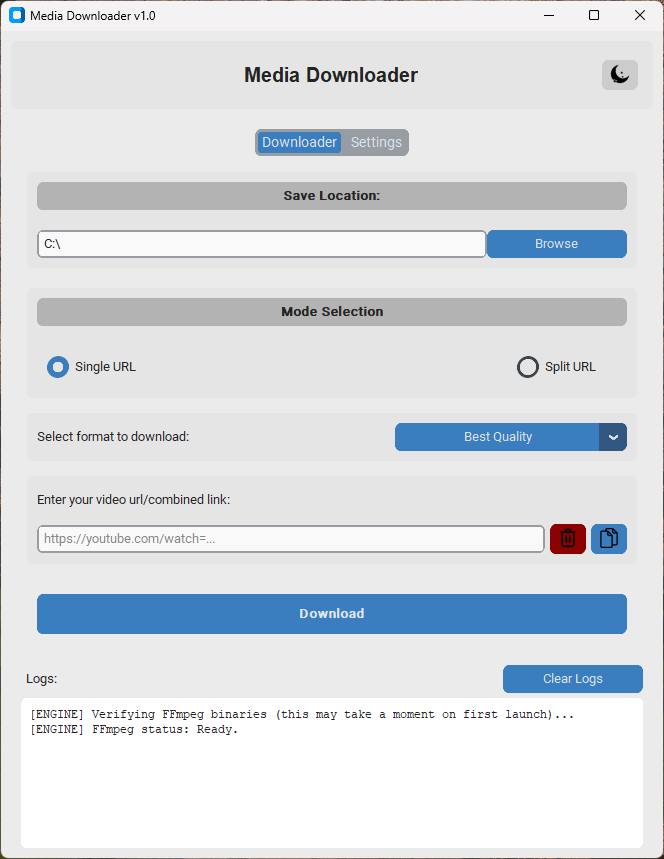
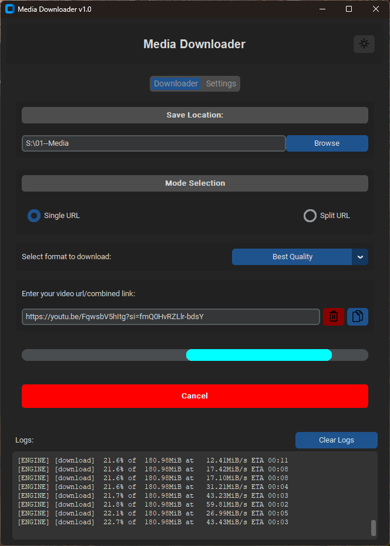

# MediaDownloader
A sleek, portable, multi-platform desktop application built to download your favorite media assets cleanly, securely, and with zero background fluff. Powered by Python and python libraries such as CustomTkinter, Yt-dlp and static-ffmpeg.





## Key Features
- **Multi-Platform Standalone Architecture**: Compiled native binaries for Windows, macOS, and Linux. No local Python installations required for the end user.

- **Modern UI/UX**: Built entirely with CustomTkinter for native dark/light mode compatibility and a responsive layout.

- **Live Feedback Logs**: Integrated stream wrapper maps live terminal outputs directly onto an application log console in real-time.


## Quick Start: How to Use
Using MediaDownloader is simple and straightforward:

1. **Paste your link**: Copy the URL of the video or audio you want to download and paste it into the main input field.

2. **Select your settings**: Choose your preferred video resolution or toggle the audio-only option if you just want an MP3/FLAC track.

3. **Hit Download**: Click the download button. The console log at the bottom will log everything happening in the background, showing your speed and progress.




## How to Download & Run
You can find pre-compiled, ready versions of the app on the [Releases](https://github.com/user-nos/url-downloader/releases) page.

1. Go to the [Releases](https://github.com/user-nos/url-downloader/releases) section on this page.

2. Download the archive mapped to your specific OS (`.zip` for Windows/macOS, `.tar.gz` for Linux).

3. Extract the contents completely and run the `MediaDownloader` binary file.

**Note**: For deep step-by-step operating system permission setup instructions or uninstallation methods, please consult our full `USER_MANUAL.pdf` located right inside your app download folder.


## Local Development Setup
If you want to run the raw source code inside your own virtual environment:

1. Clone the repository:
    ``` Bash
    git clone https://github.com/yourusername/MediaDownloader.git
    cd MediaDownloader
    ```

2. Create and activate a clean Python 3.11 virtual environment:
    ``` Bash
    python -m venv venv
    source venv/bin/activate  # On Windows use: venv\Scripts\activate
    ```

3. Install required developer packages:
    ``` Bash
    pip install -r requirements.txt
    ```

4. Run the development app layout:
    ``` Bash
    python main_app.py
    ```

